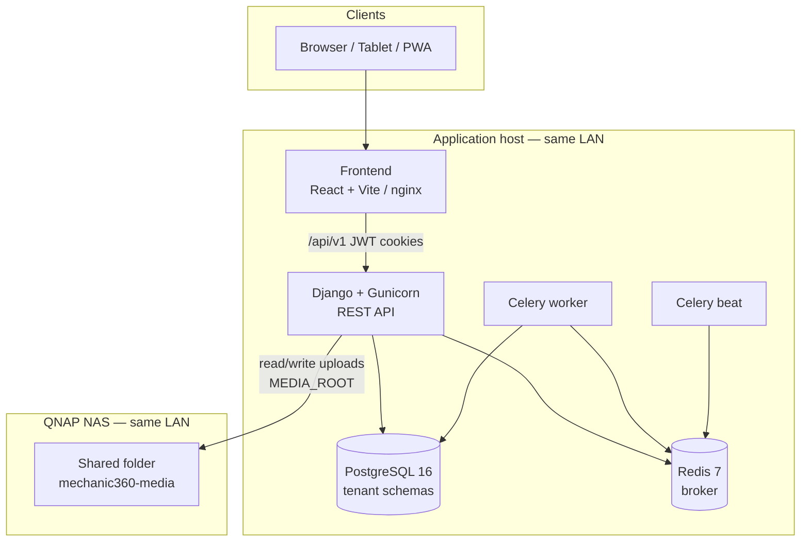
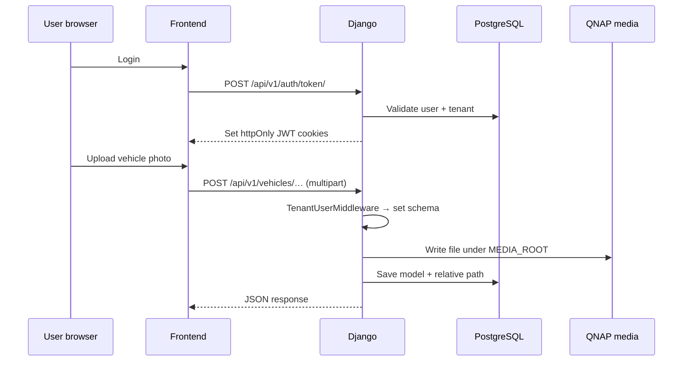

# Mechanic360 — System Architecture

Workshop management platform: multi-tenant Django API, React SPA, PostgreSQL, Redis/Celery, and **QNAP NAS** on the LAN for uploaded files (photos, documents, PDFs).

> Canonical copy: if present at repo root, see [`../ARCHITECTURE.md`](../ARCHITECTURE.md).

---

## High-level topology



---

## Component roles

| Component | Technology | Responsibility |
|-----------|------------|----------------|
| **Frontend** | React 18, TypeScript, Vite, Tailwind | Workshop UI; calls API with httpOnly JWT cookies |
| **Backend** | Django 5, DRF, Gunicorn | REST API, auth, tenant schema routing, PDF generation |
| **PostgreSQL** | 16+ | Structured data; **one schema per workshop** (`django-tenants`) |
| **Redis** | 7+ | Celery message broker |
| **Celery worker** | Celery | Async jobs (e.g. maintenance reminder emails) |
| **Celery beat** | django-celery-beat | Scheduled tasks (daily maintenance check) |
| **QNAP NAS** | NFS or SMB shared folder | **Durable file storage** for all uploads |

Marketplace listings live in the **public** PostgreSQL schema; per-workshop data (clients, vehicles, visits, inventory) lives in **tenant schemas**.

---

## File storage: Django → QNAP (production)

Uploaded files are **not** stored in PostgreSQL. Django `FileField` / `ImageField` write to `MEDIA_ROOT`, which in production is a **bind-mounted QNAP share**.

```
Django save(upload)
    → /app/media/vehicle_photos/…     (inside container)
    → /mnt/qnap/mechanic360-media/…   (host mount)
    → QNAP shared folder              (NAS disks)
```

### What gets stored on QNAP

| Path under `media/` | Source |
|---------------------|--------|
| `vehicle_photos/` | Vehicle profile images |
| `vehicle_documents/` | Service records, receipts |
| Inspection uploads | Photos attached to 360° checks |
| Generated PDFs (if cached) | Optional; most PDFs are streamed on demand |

Metadata (paths, names, FKs) stays in PostgreSQL; **bytes live on QNAP**.

### Recommended QNAP setup

1. Create shared folder: `mechanic360-media` on an **internal volume (ext4)** — preferred over USB NTFS for reliability.
2. Create a dedicated NAS user (e.g. `mechanic360-svc`) with read/write on that folder only.
3. Restrict share access to the **Docker host IP** (NFS client or SMB).
4. Mount on the Docker host, e.g. `/mnt/qnap/mechanic360-media`.
5. Include QNAP folder in **QNAP backup / snapshot** jobs.

### Docker Compose (production pattern)

Replace the dev `media_data` volume with the host mount:

```yaml
backend:
  volumes:
    - /mnt/qnap/mechanic360-media:/app/media
  environment:
    USE_S3_STORAGE: "0"
```

Celery workers do not need the QNAP mount unless a background task writes files; the **backend** service must have it.

### Host mount examples

**NFS (Linux Docker host):**

```bash
# /etc/fstab
192.168.1.50:/mechanic360-media  /mnt/qnap/mechanic360-media  nfs  defaults,_netdev  0  0
```

**SMB/CIFS:**

```bash
# /etc/fstab
//192.168.1.50/mechanic360-media  /mnt/qnap/mechanic360-media  cifs  credentials=/root/.qnap-creds,uid=1000,gid=1000,_netdev  0  0
```

Ensure the container process user can write to the mount (match `uid`/`gid` or use permissive NAS ACLs).

---

## Development vs production storage

| Environment | Storage | Config |
|-------------|---------|--------|
| **Local dev** | Docker volume `media_data` → `/app/media` | Default in `docker-compose.yml` |
| **Production (LAN)** | QNAP NFS/SMB bind mount → `/app/media` | Host path mounted into backend container |

S3 / MinIO / django-storages are **not used** in the current deployment model.

---

## Request and tenant flow



Tenant isolation: JWT identifies the user → middleware sets PostgreSQL schema to the workshop → queries never cross tenants.

---

## Network layout (typical LAN)

```
┌─────────────────────────────────────────────────────────────┐
│  LAN 192.168.x.x                                            │
│                                                             │
│  ┌──────────────┐    ┌─────────────────────────────┐       │
│  │ QNAP NAS     │    │ App server (Docker host)     │       │
│  │ : NFS/SMB    │◄───│  frontend :443/:5173       │       │
│  │ mechanic360- │    │  backend  :8000            │       │
│  │ media        │    │  postgres, redis, celery   │       │
│  └──────────────┘    └─────────────────────────────┘       │
│         ▲                        ▲                          │
│         │    bind mount          │                          │
│         └────────────────────────┘                          │
│                                                             │
│  Workshop tablets / PCs ──► HTTPS ──► frontend / API        │
└─────────────────────────────────────────────────────────────┘
```

---

## Security notes

- **NAS**: Dedicated service account, IP allowlist, no guest access.
- **API**: JWT in httpOnly cookies; CORS limited to frontend origin(s).
- **Media URLs**: Serve `/media/` via nginx with auth or signed URLs in production.
- **Backups**: PostgreSQL dumps **and** QNAP folder snapshots.

---

## Code references

| Concern | Location |
|---------|----------|
| Media root | `backend/mechanic360/settings.py` — `MEDIA_ROOT` |
| Vehicle photos / documents | `backend/vehicles/models.py` |
| Inspection uploads | `backend/inspections/upload_views.py` |
| Tenant middleware | `backend/mechanic360/middleware.py` |
| Dev Compose volumes | `docker-compose.yml` — `media_data` |
