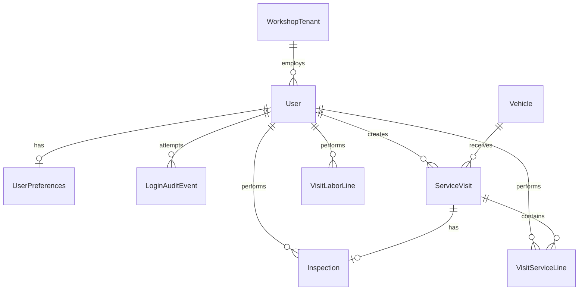

# User Profile, Login Audit, Mechanic Staff & KPIs

**Status:** Phase A + Phase B + Phase C + Phase D + Phase E (v1) implemented (2026-05-28); Phase F pending  
**Related:** `working_scope.md` §2, §7, §14, §15; `DEVELOPMENT_REFERENCE.md`; MECH-7 (auth)

---

## 1. Goals

| Area | Goal |
|------|------|
| **User profile** | Reliable read/update of personal info (name, email, phone) from Settings |
| **Password & PIN** | Fix password change from profile; secure PIN update with validation and clear errors |
| **Login audit** | Record successful and failed login attempts for security review |
| **Mechanic staff** | Workshop admins invite/add mechanics and advisors to their tenant |
| **Work attribution** | Know which mechanic worked on which vehicle and which tasks |
| **Mechanic KPIs** | Per-mechanic metrics for workshop managers (throughput, revenue, quality) |

---

## 2. Current state (gaps)

### 2.1 Settings / profile (broken or incomplete)

**Backend:** `GET/PATCH /api/v1/auth/settings/` via `SettingsSerializer` (`accounts/serializers.py`).

| Field | Persisted? | Notes |
|-------|------------|-------|
| `first_name`, `last_name`, `email` | Yes | On `User` |
| Password change | Partial | Logic exists; frontend error handling often misses DRF field errors |
| `quick_pin` | Yes | Requires `current_password` |
| `workshop_*`, `language`, `currency` | Partial | Only when `user.tenant` is set; updates tenant, not user |
| `theme`, notification toggles | **No** | Accepted in serializer defaults but **never saved** to DB |

**Frontend:** `SettingsPage.tsx` — single save handler; Security tab password button calls same PATCH; errors expect `response.data.message` instead of DRF `{ field: ["…"] }`.

**Fix scope:**

- [x] Persist user preferences (`theme`, notification toggles) — fields on `User` (migration `0005_user_profile_preferences`)
- [x] Split **Profile** (personal) vs **Workshop** (tenant admin only) in UI and API permissions
- [x] Map API validation errors to user-visible messages (i18n + `getApiErrorMessage`)
- [x] Add client-side validation: password length, match confirm, require current password
- [x] Tests: password change success/failure, PIN update, profile PATCH, tenant admin workshop update
- [x] Superuser / platform admin: profile only (no workshop block)

### 2.2 Login audit (missing)

No model or middleware records login outcomes today. JWT login lives in `accounts/auth_views.py` and PIN login in `accounts/pin_auth.py`.

**Fix scope:**

- [x] New model `LoginAuditEvent` (public schema):

  | Field | Type | Notes |
  |-------|------|-------|
  | `id` | UUID | PK |
  | `username_attempted` | string | As typed (even if user missing) |
  | `user` | FK User, nullable | Set on success when user exists |
  | `tenant` | FK WorkshopTenant, nullable | Resolved tenant if applicable |
  | `outcome` | enum | `success`, `failed_password`, `failed_pin`, `failed_unknown_user`, `failed_inactive`, `failed_tenant_inactive` |
  | `auth_method` | enum | `password`, `pin`, `refresh` |
  | `ip_address` | generic IP | From `X-Forwarded-For` / request |
  | `user_agent` | string | Truncated |
  | `created_at` | datetime | Indexed |

- [x] Log on every login attempt (success and failure) in auth views
- [ ] Rate-limit + optional lockout policy (future; document threshold in settings)
- [x] **Tenant admin UI:** last 30 days for users in their workshop (read-only)
- [x] **Superuser UI:** platform-wide filterable log (`/admin/security/logins` or similar)
- [x] Retention: 90 days default (configurable); Celery cleanup task
- [x] GDPR: no password/PIN in logs; pseudonymize IP optional later

### 2.3 Mechanic invite / staff management (backend only)

**Exists:**

- `POST /api/v1/auth/register/` — tenant admin creates staff (`RegisterView`)
- `CRUD /api/v1/auth/tenant/users/` — `TenantUserViewSet` (admin only, max 5 users/tenant)
- Roles: `service_advisor`, `mechanic` (+ `admin` for workshop owner)

**Missing:**

- [x] Frontend **Team** page under workshop settings (`/settings/team` or `/team`)
- [x] List, add, deactivate mechanics/advisors
- [ ] **Invite flow** (phase 2): email invite link → set password on first login
- [ ] Optional: temporary password + force change on first login
- [ ] Display user limit (5) and link to contact superadmin for increase
- [x] i18n for all team management strings

**Business rules:**

- Only tenant **Admin** can invite/manage staff
- Service Advisor can view team list (read-only) — optional
- Mechanic cannot access team management
- Deactivate user (`is_active=False`) instead of hard delete when history exists

### 2.4 Work attribution (partial)

**Today:**

| Entity | Mechanic link |
|--------|----------------|
| `ServiceVisit` | `created_by` (who opened visit) |
| `Inspection` | `performed_by` |
| `VisitServiceLine` | **None** |
| `VisitLaborLine` | **None** |
| `VisitMaterialLine` | **None** |

Reports use `visit_mechanic_user()` — prefers inspection performer, else visit creator (`visits/report_utils.py`).

**Fix scope:**

- [x] Add optional `assigned_to` / `performed_by` FK on `VisitServiceLine` and `VisitLaborLine`
- [x] Default `performed_by` to current user on create when role is mechanic
- [x] Visit detail UI: assign mechanic per line or per visit
- [x] Vehicle service history: show mechanic name per line and inspection
- [x] API filters: `?mechanic=<user_id>` on visits list

### 2.5 Mechanic KPIs (new)

Per-mechanic dashboard for **Admin** and **Service Advisor** (mechanics see own stats only).

**Suggested KPIs (v1):**

| KPI | Source |
|-----|--------|
| Visits completed | `ServiceVisit` status=completed, attributed mechanic |
| Inspections performed | `Inspection.performed_by` |
| Service lines completed | `VisitServiceLine.performed_by` |
| Labor hours logged | Sum `VisitLaborLine.hours` by mechanic |
| Revenue (labor + services) | Sum line totals attributed to mechanic |
| Avg. visit duration | completed_at − created_at (needs `completed_at` on visit if missing) |
| Vehicles touched | Distinct `vehicle_id` count |
| Period comparison | vs previous week/month |

**UI:**

- [x] `/analytics/mechanics` — table + drill-down to mechanic detail
- [x] Mechanic detail: list of visits/vehicles/lines in date range
- [ ] Export CSV/PDF (phase 2)
- [ ] Charts: visits over time, top services (Recharts)

**API:**

- [x] `GET /api/v1/analytics/mechanics/` — summary rows per user
- [x] `GET /api/v1/analytics/mechanics/{user_id}/` — detail breakdown
- [x] Tenant-scoped; permission `IsAdvisorOrAdmin` for all mechanics; mechanic role sees self only

---

## 3. Data model summary (new/changed)

---

## 4. API endpoints (target)

| Method | Path | Role | Purpose |
|--------|------|------|---------|
| GET/PATCH | `/api/v1/auth/settings/` | Authenticated | Profile + preferences + password (fixed) |
| GET | `/api/v1/auth/login-audit/` | Tenant admin | Tenant login events |
| GET | `/api/v1/admin/login-audit/` | Superuser | Platform login events |
| GET/POST/PATCH | `/api/v1/auth/tenant/users/` | Tenant admin | Staff CRUD (exists) |
| POST | `/api/v1/auth/tenant/users/invite/` | Tenant admin | Email invite (phase 2) |
| GET | `/api/v1/analytics/mechanics/` | Advisor/Admin | KPI summary |
| GET | `/api/v1/analytics/mechanics/{id}/` | Advisor/Admin or self | KPI detail |

---

## 5. Frontend pages (target)

| Route | Audience | Content |
|-------|----------|---------|
| `/settings` | All staff | Profile, Security (password/PIN) — fixed |
| `/settings/team` | Tenant admin | Invite/add mechanics, deactivate |
| `/settings/security/log` | Tenant admin | Login audit for workshop users |
| `/analytics/mechanics` | Admin, Advisor | KPI table |
| `/analytics/mechanics/:id` | Admin, Advisor, self | Drill-down |
| `/admin/security/logins` | Superuser | Platform login audit |

---

## 6. Implementation phases

### Phase A — Fix profile & password (priority)

1. Fix `SettingsSerializer` persistence for preferences
2. Fix frontend error display + i18n
3. Permission split: workshop fields admin-only
4. Automated tests

### Phase B — Login audit

1. Model + migration
2. Hook auth views
3. Tenant admin + superuser read APIs and UI
4. Retention task

### Phase C — Team management UI

1. Team list/create/edit using existing `TenantUserViewSet`
2. Deactivate user flow
3. i18n

### Phase D — Work attribution

1. Migrations for line-level `performed_by`
2. Serializers + visit UI assignment
3. History/report updates

### Phase E — Mechanic KPIs

1. Analytics queries in `visits/analytics_views.py` (extend)
2. Dashboard pages + charts
3. Tests with seeded visit data

### Phase F — Email invite (optional)

1. Invite token model
2. Celery email
3. First-login password set flow

---

## 7. Acceptance criteria

- [ ] User can change password from Settings → Security; wrong current password shows clear error
- [ ] User can update first/last name and email; changes persist after reload
- [ ] Tenant admin can update workshop contact info; mechanic cannot
- [ ] Every login attempt creates an audit row viewable by tenant admin
- [ ] Tenant admin can add a mechanic account; mechanic can log in and appear in KPI list after work
- [ ] Visit report shows correct mechanic per inspection and service line
- [ ] Analytics page shows per-mechanic visit count and labor hours for selected period

---

## 8. Out of scope (for now)

- Payroll / timesheet export
- Mechanic mobile app separate from PWA
- Biometric login
- MFA (documented in ISO section as future)
