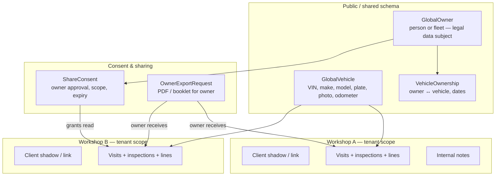

# Global Vehicle Registry & Cross-Tenant History Policy

**Status:** Draft — architectural target (replaces schema-isolated vehicles)  
**Related:** `working_scope.md` §4, §11; marketplace privacy rules; GDPR consent (planned)

---

## 1. Principles

| Principle | Rule |
|-----------|------|
| **Global vehicle identity** | One canonical vehicle record per VIN (or platform ID), visible to all workshops |
| **Local service history** | Visits, inspections, parts used, and invoices created by a workshop stay **owned by that workshop** by default |
| **Owner sovereignty** | The **vehicle owner** controls whether history leaves their “home” context or is shown to other workshops |
| **No silent sharing** | Cross-tenant history access always requires an **explicit consent record** (owner approval or owner-initiated export) |
| **Operational data stays private** | Clients, inventory, pricing, staff notes marked internal, and marketplace unrelated data are never auto-shared |

---

## 2. Data layers

### 2.1 Global (all tenants)

**`GlobalVehicle`** — single source of truth

- VIN (unique), license plate, make, model, year, engine/fuel
- Current odometer / hour meter (updated from latest completed visit any shop)
- Photo(s), QR payload
- `registered_by_tenant_id` (first workshop that created the record)
- `is_active`

**Any authenticated workshop user may:**

- Search and **read** global vehicle fields
- **Create** if VIN not exists
- **Update** operational fields when servicing (mileage, hours, photo) — logged in audit

**No tenant may:**

- Delete global vehicle if any tenant has visit history (soft-archive only)
- Read another tenant’s visit/inspection rows without consent

### 2.2 Per-tenant (workshop-scoped)

Stays isolated per workshop (row-level `tenant_id`, not separate schemas in target architecture):

| Entity | Scoped to tenant |
|--------|------------------|
| `ServiceVisit` | Yes — `performing_tenant_id` |
| `Inspection` | Yes — via visit |
| Service / material / labor lines | Yes |
| Workshop `Client` record | Yes — local CRM copy |
| Inventory deductions | Yes |
| Internal visit notes (`visibility=internal`) | Yes — never shared |

Each visit links: `global_vehicle_id` + `tenant_client_id` (local client at time of service).

### 2.3 Owner (data subject)

**`GlobalOwner`** — platform-level person or fleet account

- Name, contact, preferred channel
- May link to one or more `GlobalVehicle` via **`VehicleOwnership`**
- Can authenticate later (owner portal / magic link) to approve shares and request exports

Workshop **Client** rows are **tenant-local CRM entries** that may reference `global_owner_id` when matched (same email/phone/VIN), but remain editable per shop.

---

## 3. Access matrix

| Actor | Global vehicle profile | Own tenant visit history | Other tenant visit history |
|-------|------------------------|--------------------------|----------------------------|
| Mechanic (any shop) | Read + update operational fields | Full (CRUD while open) | **Deny** unless consent |
| Service advisor | Same | Full | **Deny** unless consent |
| Workshop admin | Same | Full | **Deny** unless consent |
| Vehicle owner | Read own vehicles | Via export only | Via export only (aggregated) |
| Other shop after consent | Read vehicle | — | **Read-only**, scoped by consent |
| Marketplace / public | No visit data | No | No |

---

## 4. Workflows

### 4.1 Register or find vehicle (any workshop)

1. Mechanic scans QR or searches **global registry** by VIN / plate.
2. If **found** → open global profile; start visit linked to `global_vehicle_id`.
3. If **not found** → create `GlobalVehicle`; set `registered_by_tenant_id`.
4. Link or create local **Client** for this service (tenant CRM).
5. Visit + inspection created under **this tenant only**.

No other tenant sees the new visit automatically.

### 4.2 Complete visit (unchanged operationally)

1. Mandatory 360° inspection, lines, finish visit.
2. Update global odometer/hours from visit (max of readings).
3. History record stored with `performing_tenant_id = current tenant`.

### 4.3 Owner requests their history (owner-initiated)

**Trigger:** Owner asks workshop OR uses owner portal / email link.

1. Owner verifies identity (email/SMS OTP tied to `GlobalOwner`).
2. Owner selects vehicle and scope:
   - Single workshop history
   - **All workshops** (full digital service booklet)
3. System generates PDF / export from **all consented or owner-owned data**.
4. Audit log: `OwnerExportRequest` (who, when, scope).

No other workshop approval needed — this is the owner’s data.

### 4.4 Share history with another workshop (owner-approved)

**Scenario:** Vehicle serviced at Shop A; owner takes it to Shop B. Shop B needs prior history.

1. Shop B mechanic opens global vehicle → sees profile + **“History from other workshops: restricted”**.
2. Shop B requests access **OR** owner initiates share from Shop A / owner portal.
3. **Owner approval required:**
   - Channel: SMS / email / in-app
   - Owner selects: **which past workshops** (or all) and **expiry** (e.g. 30 days, one-time view)
4. System creates **`ShareConsent`**:
   - `owner_id`, `vehicle_id`
   - `granting_tenant_id` (optional — shop that holds the records)
   - `recipient_tenant_id` (Shop B)
   - `scope`: `summary` | `full_inspections` | `full_visits`
   - `expires_at`, `revoked_at`
5. Shop B queries history API → backend checks consent → returns read-only visit list for that vehicle from allowed tenants.

**Revocation:** Owner or granting shop admin can revoke anytime; access ends immediately.

### 4.5 Ownership change

1. Update `VehicleOwnership` (new owner, effective date).
2. **All historical visits remain** on global vehicle, still scoped to performing tenant.
3. New owner inherits **request/export** rights; previous owner loses approval rights unless legally retained (configurable retention policy).
4. Existing `ShareConsent` records for old owner → auto-revoke or expire.

---

## 5. Consent & audit records

### `ShareConsent` (minimum fields)

| Field | Purpose |
|-------|---------|
| `id` | UUID |
| `global_vehicle_id` | Vehicle |
| `global_owner_id` | Who approved |
| `recipient_tenant_id` | Workshop receiving access |
| `source_tenant_ids` | Which shops’ history included (empty = all) |
| `scope` | summary / inspections / full |
| `approved_at` | Timestamp |
| `expires_at` | Optional TTL |
| `revoked_at` | Early cancel |
| `approval_method` | sms / email / portal |
| `approved_by_user_id` | If staff assisted owner at counter |

### Audit (ISO/GDPR-friendly)

Log every:

- Cross-tenant history read (who, which consent id)
- Owner export
- Consent grant / revoke
- Global vehicle field change (which tenant, which user)

---

## 6. API rules (target)

| Endpoint pattern | Policy |
|------------------|--------|
| `GET /api/v1/vehicles/global/` | All tenants — search registry |
| `GET /api/v1/vehicles/global/{id}/` | All tenants — profile |
| `GET /api/v1/vehicles/global/{id}/history/` | Default: **current tenant only** |
| `GET .../history/?include=shared` | Other tenants’ visits **only if valid ShareConsent** |
| `POST .../share-requests/` | Shop B requests owner approval |
| `POST /api/v1/owner/consents/` | Owner approves (authenticated owner) |
| `POST /api/v1/owner/exports/` | Owner export booklet |

Backend must enforce on **every** history query — not UI alone.

---

## 7. UI expectations

| Screen | Behavior |
|--------|----------|
| Vehicle search | Global registry across tenants |
| Vehicle profile | Global specs + **this shop’s** visits tab by default |
| Other shops tab | Hidden or locked until consent; show “Request owner approval” |
| Owner portal (future) | Approve shares, download full history, revoke access |
| Visit detail | Badge: “Performed at [Workshop Name]” when viewing shared history |

---

## 8. Restrictions (hard rules)

1. **Never** expose another tenant’s client PII in shared history (show workshop name + service data only; mask client name unless owner export).
2. **Never** expose internal notes or cost/margin fields cross-tenant unless scope explicitly includes and owner approves.
3. **Never** allow cross-tenant **write** to visits (read-only via consent).
4. **Inventory and marketplace** remain tenant-isolated.
5. VIN uniqueness is **global** — duplicate create rejected; merge workflow for conflicts.
6. Consent without verified owner identity is **invalid**.

---

## 9. Migration from current architecture

**Today:** `django-tenants` schema isolation; vehicles duplicated per schema.

**Target:**

1. Move vehicle master to **public / shared** tables (`GlobalVehicle`).
2. Move tenancy to **row-level** (`tenant_id`) for visits, clients, inventory.
3. Add `ShareConsent`, `GlobalOwner`, `VehicleOwnership`.
4. Migrate existing per-schema vehicles → merge by VIN.
5. Attach existing visits to global vehicle + original tenant id.
6. Replace `connection.set_schema()` with tenant context + RLS (recommended).

---

## 10. Open decisions (need product confirmation)

| # | Question | Options |
|---|----------|---------|
| 1 | Can Shop B edit global vehicle specs (plate, photo)? | Read-only vs last-servicing-shop-wins vs admin merge |
| 2 | Owner verification for in-shop approval | OTP always vs trusted staff attestation |
| 3 | Default consent TTL | 30 / 90 days / per visit |
| 4 | Fleet owners | Company admin approves for all fleet vehicles |
| 5 | ManageFleet integration | Global registry fed from external fleet master |

---

## 11. Summary sentence

**Vehicles are global and visible to every workshop; service history belongs to the workshop that performed the work until the vehicle owner explicitly authorizes sharing or requests their own export.**
